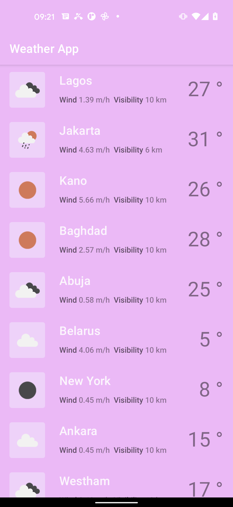
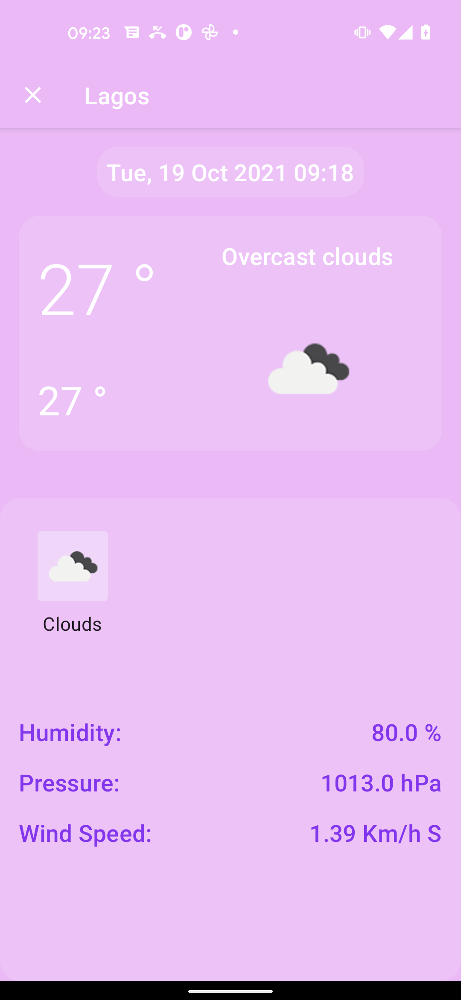
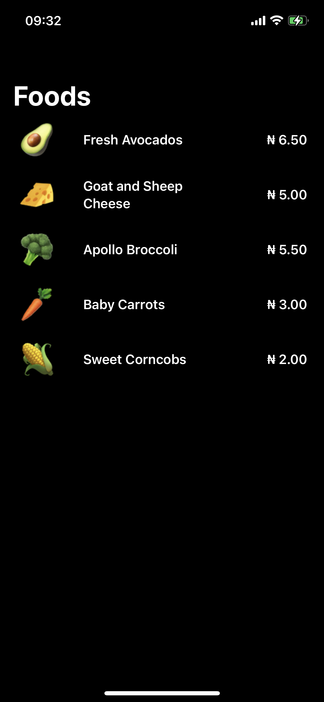
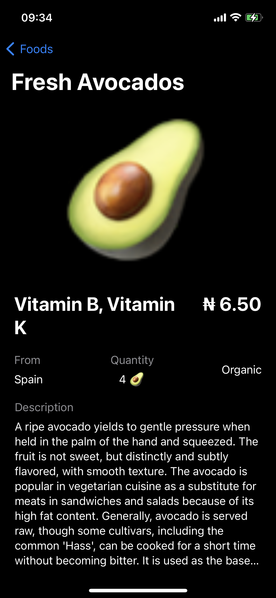

# Weather App - Coding Test
 
 This coding test contains two solutions 
*  Android Weather App - Android / Kotlin
*  iOS Food App - iOS Swift.

## Screenshots

### Android  - Weather App

#### Important Dependencies
* Dagger Hilt
* Retrofit 
* Jetpack Compose 
* Navigation Arch. Component + Navigation Compose
* Coil
* Cooroutine

### iOS  - Food App

#### Important Dependencies
* Swift UI

